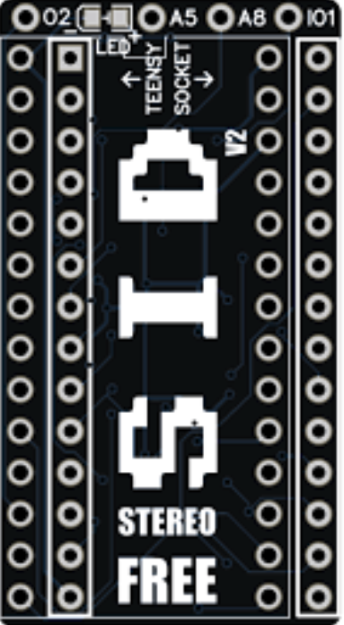

# FreeStereoSID (Design by Matthias, cloned here)

  

Beschreibung

Der "Free Stereo SID" besteht aus den folgenden beiden Komponenten: 

 *  SID Sockel Adapter-Platine mit Level-Shifter und Sockel für einen

 *  Teensy 4.0 

welche man dann in einen C64 SID Sockel stecken kann. 

Der ganze "Free Stereo SID" ist Public Domain, komplett und "wirklich" frei. 

Kein Open Source, keine Fussfessel ala "General Public License (GPL)" oder dergleichen. Man kann also damit machen was man möchte ;-)

Die Software befindet sich noch in der Entwicklung (Beta). 

(Matthias)

-----------------------------------------------------

Have fun ;-)

cassy

